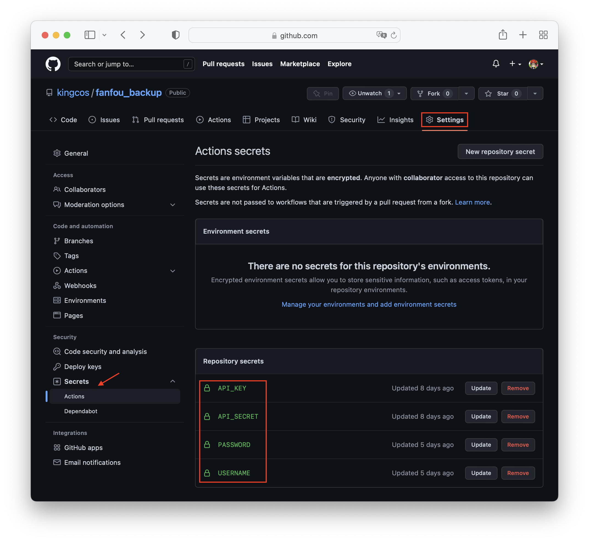

# fanfou_backup

[](https://github.com/kingcos/fanfou_backup/actions/workflows/main.yml)

A GitHub Actions workflow for backup of fanfou.com.

基于 GitHub Actions 工作流定时备份个人发布的饭否内容（原始 JSON 及图片）。

## 设置

1. Fork 本仓库
2. 根据下图，设置密钥，包含饭否认证的 API Key 和 API Secret，以及您的账户和密码：



3. 设置完成后，您可手动触发 Action 或等待每日定时触发（默认每日 10:00 UTC）。

> 注意：首次备份较多时可能会花费较长时间。

## Q&A

### 关于密钥（Secret）

本项目使用的是 GitHub Repository secrets（仓库密钥），因此不会将饭否 API Key 和 API Secret、以及账户和密码暴露至外部。

因饭否目前（应该？）已经停止开发者注册，您可以在 GitHub 中找到饭否客户端相关项目的开源实现，并使用其 API Key 和 API Secret。所有 API Key 和 API Secret 请您合理规范使用，请勿滥用。本工作流不保存、不共享任何 API Key 和 API Secret。

本工作流不保存、不共享您的账户和密码，代码中也仅作为 OAuth 登录以及获取本人用户 ID 使用。

### 关于定时时间、频率

您可以使用 `cron` 表达式更改 Action 的运行时间或频率，默认为每日 10:00 UTC：

```yml
# .github/workflows/main.yml

# Controls when the workflow will run
on:
  schedule:
    - cron: 0 10 * * * # 您可自由更改此处的定时时间、频率
```

### 更多

我正在考虑将备份的内容以独立页面的方式展示，关于本项目您有任何问题或建议均可提出 Issue。

## LICENSE

- MIT
